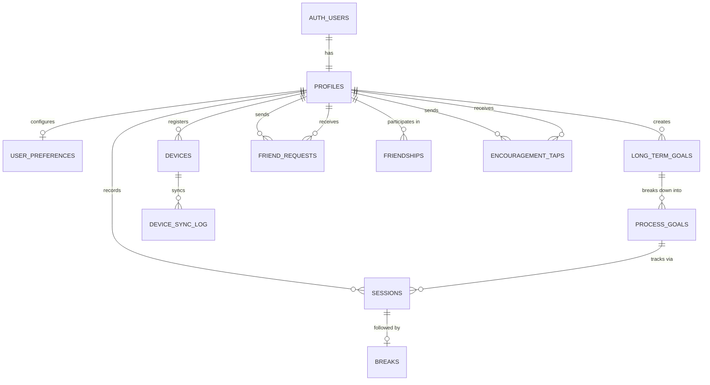
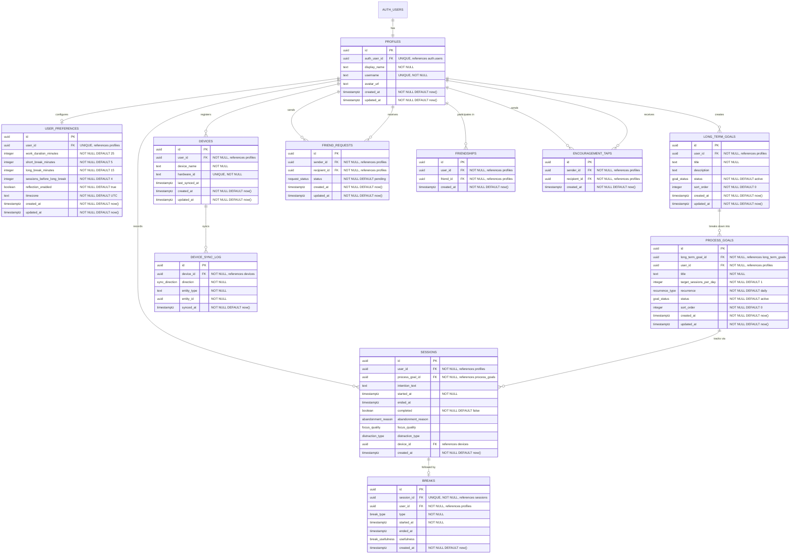
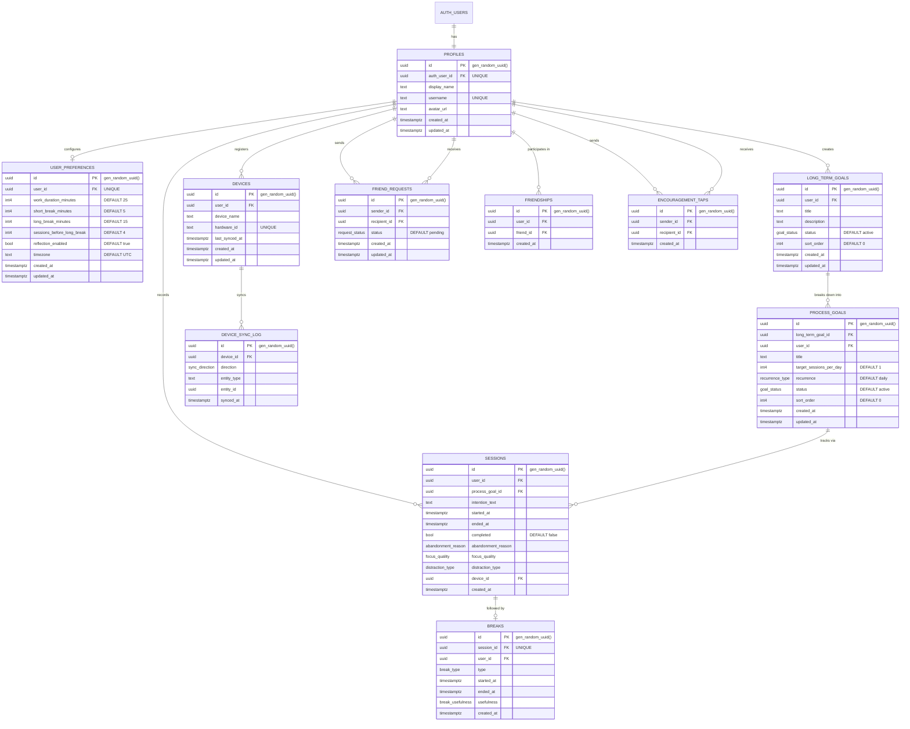

# Design: Database Schema & Data Model

**Date:** 2026-03-07
**Status:** Accepted
**Related ADR:** [ADR-005](../decisions/004-database-schema-data-model.md)
**Platforms:** All (schema is platform-agnostic; all platforms access via Supabase API)

## Context & Scope

PomoFocus stores user goals, focus sessions, reflection data, social connections, and device registrations in a Supabase-hosted Postgres database. The schema must support: a three-layer goal hierarchy (long-term → process → session intention), 8 data points per session with post-session reflection, social features (friends, Library Mode, Quiet Feed, encouragement taps), BLE device sync, and computed analytics (Focus Score, weekly insights, monthly deep views). All data is scoped per user via Supabase RLS using `auth.uid()`. Anonymous users (deferred sign-up) create data before authenticating.

## Goals & Non-Goals

**Goals:**
- Model all v1 domains: users, goals, sessions, social, devices
- Support all analytics queries from product brief Section 10
- Enable RLS with a clean path to `auth.uid()` on every table
- Support deferred sign-up (anonymous → authenticated with zero data migration)
- Support BLE device incremental sync
- Use Postgres-native features (enums, timestamptz, gen_random_uuid())

**Non-Goals:**
- Offline-first sync strategy (deferred to separate /tech-design session)
- Post-v1 features: shared sessions, study crews, subscription billing, data export
- Materialized views for analytics caching (add when performance requires it)
- Migration tooling setup (handled by Supabase CLI)

---

## Level 1: Conceptual Model

### Entity List

| Domain | Entity | Description | Product Brief Source |
|--------|--------|-------------|---------------------|
| Users | `auth.users` | Supabase-managed auth identities (email, OAuth, anonymous) | S8, ADR-002 |
| Users | `profiles` | Application user data (display name, username, avatar) | S8, S9 |
| Users | `user_preferences` | Timer defaults, timezone | S6, S8 |
| Goals | `long_term_goals` | Big-picture aspirations: "Get strong at calculus" | S3, S6 |
| Goals | `process_goals` | Daily/weekly habits: "3 sessions/day." Streaks attach here. | S3, S6 |
| Sessions | `sessions` | Focus blocks with reflection data (8 data points per S10) | S6, S10 |
| Sessions | `breaks` | Break periods with usefulness rating | S6 |
| Social | `friend_requests` | Pending friend request (sender → recipient) | S9 |
| Social | `friendships` | Confirmed mutual friendship (dual-row pattern) | S9 |
| Social | `encouragement_taps` | Private one-tap kudos | S9 |
| Devices | `devices` | Registered BLE devices | S5 |
| Devices | `device_sync_log` | Incremental sync tracking per device | S5 |

**Not modeled as tables (and why):**
- **Session intentions** — text column on `sessions`, not a separate table (1:1, no independent lifecycle)
- **Quiet Feed** — derived query: `SELECT DISTINCT DATE(started_at), user_id FROM sessions WHERE completed = true`
- **Library Mode** — derived query: `sessions WHERE ended_at IS NULL` for active sessions
- **Goal templates** — hardcoded in application code (`core/`), not database (S12: "6 hardcoded templates")
- **Invite links** — stateless URLs: `pomofocus.app/invite/USERNAME`
- **Streaks** — computed from consecutive days with completed sessions per process goal
- **Daily summaries** — derivable from sessions; add materialized view later if needed

### ER Diagram (relationships only)



### Business Rules

| Rule | Source | Schema Enforcement |
|------|--------|--------------------|
| Every auth user has exactly one profile | ADR-002 | UNIQUE on `profiles.auth_user_id` |
| A session always belongs to a process goal | S6 L241 | `sessions.process_goal_id NOT NULL` |
| A process goal always belongs to a long-term goal | S6 L199-204 | `process_goals.long_term_goal_id NOT NULL` |
| Friendships are mutual | S9 L433 | Dual-row pattern: (A,B) and (B,A) |
| Can't befriend yourself | Common sense | `CHECK(user_id != friend_id)` |
| One friend request per pair | S9 | `UNIQUE(sender_id, recipient_id)` |
| One break per session max | S6 L276 | `UNIQUE(session_id)` on breaks |
| "Had to stop" excluded from success rate | S10 L536-539 | `abandonment_reason` enum, filtered in queries |
| Distraction type only when "struggled" | S10 L547 | Application-level; `distraction_type` nullable |
| One device per hardware ID | S5 L172 | `UNIQUE(hardware_id)` on devices |

---

## Level 2: Logical Model

### ER Diagram (full attributes)



### Normalization Notes

The schema is in **3NF** with two intentional denormalizations:

1. **`process_goals.user_id`** — Derivable via `long_term_goals.user_id`. Denormalized for: (a) direct RLS path to `auth.uid()` without joining through long_term_goals, (b) the "show my active process goals" query is the single most common query (home screen, widget, device sync) and skipping a join matters.

2. **`breaks.user_id`** — Derivable via `sessions.user_id`. Denormalized for the same RLS reason: every table needs a direct path to the user for policy evaluation.

Duration is NOT stored — computed as `EXTRACT(EPOCH FROM ended_at - started_at)` to avoid redundancy.

### Key Design Decisions

| Decision | Chosen | Alternative | Why |
|----------|--------|------------|-----|
| Reflection data location | Columns on `sessions` | Separate `session_reflections` table | 1:1 relationship, always queried together, avoids join on every analytics query |
| Timer preferences storage | Normalized columns | jsonb blob | Explicit columns have DB-level defaults, validation, and are easier for agents to type |
| Friendship representation | Dual-row (A,B) + (B,A) | Single-row with OR clause | Doubles storage (negligible for friend counts) but makes queries and RLS trivially simple |
| Session intention | Text column on sessions | Separate table | 1:1, no independent lifecycle, no separate queries needed |
| Quiet Feed / Library Mode | Derived queries | Dedicated tables | Avoids data duplication; queries are simple and fast with proper indexes |
| ID strategy | UUID v4 (gen_random_uuid) | Serial, UUID v7 | Required for offline BLE sync (collision-free). v7 considered but Postgres doesn't natively generate it yet. |
| Timestamps | Always timestamptz | timestamp without tz | Users span timezones; sessions created in EST must render correctly in PST |
| Deletes | Hard deletes | Soft deletes (deleted_at) | Simpler for v1. No undo flow in product brief. Can add per-table later if needed. |

---

## Level 3: Physical Model (Postgres)

### Enum Types

```sql
CREATE TYPE goal_status AS ENUM ('active', 'completed', 'retired');
CREATE TYPE recurrence_type AS ENUM ('daily', 'weekly');
CREATE TYPE abandonment_reason AS ENUM ('had_to_stop', 'gave_up');
CREATE TYPE focus_quality AS ENUM ('locked_in', 'decent', 'struggled');
CREATE TYPE distraction_type AS ENUM ('phone', 'people', 'thoughts_wandering', 'got_stuck', 'other');
CREATE TYPE break_type AS ENUM ('short', 'long');
CREATE TYPE break_usefulness AS ENUM ('yes', 'somewhat', 'no');
CREATE TYPE request_status AS ENUM ('pending', 'accepted', 'declined');
CREATE TYPE sync_direction AS ENUM ('up', 'down');
```

### ER Diagram (Postgres types)



### Index Strategy

```sql
-- profiles
CREATE UNIQUE INDEX idx_profiles_auth_user_id ON profiles (auth_user_id);
CREATE UNIQUE INDEX idx_profiles_username ON profiles (username);

-- long_term_goals
CREATE INDEX idx_long_term_goals_user_id ON long_term_goals (user_id);
CREATE INDEX idx_long_term_goals_user_active ON long_term_goals (user_id) WHERE status = 'active';

-- process_goals
CREATE INDEX idx_process_goals_user_id ON process_goals (user_id);
CREATE INDEX idx_process_goals_long_term ON process_goals (long_term_goal_id);
CREATE INDEX idx_process_goals_user_active ON process_goals (user_id) WHERE status = 'active';

-- sessions (most-queried table)
CREATE INDEX idx_sessions_user_started ON sessions (user_id, started_at);
CREATE INDEX idx_sessions_process_goal ON sessions (process_goal_id);
CREATE INDEX idx_sessions_active ON sessions (user_id) WHERE ended_at IS NULL;
CREATE INDEX idx_sessions_device ON sessions (device_id) WHERE device_id IS NOT NULL;

-- breaks
CREATE UNIQUE INDEX idx_breaks_session ON breaks (session_id);
CREATE INDEX idx_breaks_user ON breaks (user_id);

-- devices
CREATE UNIQUE INDEX idx_devices_hardware ON devices (hardware_id);
CREATE INDEX idx_devices_user ON devices (user_id);

-- device_sync_log
CREATE INDEX idx_sync_log_device_entity ON device_sync_log (device_id, entity_type, entity_id);

-- friend_requests
CREATE UNIQUE INDEX idx_friend_requests_pair ON friend_requests (sender_id, recipient_id);
CREATE INDEX idx_friend_requests_recipient ON friend_requests (recipient_id);

-- friendships
CREATE UNIQUE INDEX idx_friendships_pair ON friendships (user_id, friend_id);
CREATE INDEX idx_friendships_friend ON friendships (friend_id);

-- encouragement_taps
CREATE INDEX idx_taps_recipient ON encouragement_taps (recipient_id, created_at);
CREATE INDEX idx_taps_sender ON encouragement_taps (sender_id);
```

### RLS Policies

**Helper function:**

```sql
-- Returns the profile ID for the currently authenticated user.
-- SECURITY DEFINER so it can query profiles regardless of RLS on profiles itself.
-- STABLE because it returns the same value within a transaction.
CREATE OR REPLACE FUNCTION get_user_id() RETURNS uuid AS $$
  SELECT id FROM profiles WHERE auth_user_id = auth.uid()
$$ LANGUAGE sql SECURITY DEFINER STABLE;
```

**profiles:**

```sql
ALTER TABLE profiles ENABLE ROW LEVEL SECURITY;

-- Users can read their own profile
CREATE POLICY "profiles_select_own" ON profiles
  FOR SELECT USING (auth_user_id = auth.uid());

-- Users can read friends' profiles
CREATE POLICY "profiles_select_friends" ON profiles
  FOR SELECT USING (
    id IN (SELECT friend_id FROM friendships WHERE user_id = get_user_id())
  );

-- Users can read profiles by username (for friend search)
CREATE POLICY "profiles_select_by_username" ON profiles
  FOR SELECT USING (username IS NOT NULL);

-- Users can update their own profile
CREATE POLICY "profiles_update_own" ON profiles
  FOR UPDATE USING (auth_user_id = auth.uid());

-- Profile creation handled by trigger (on auth.users insert)
CREATE POLICY "profiles_insert" ON profiles
  FOR INSERT WITH CHECK (auth_user_id = auth.uid());

-- Users can delete their own profile
CREATE POLICY "profiles_delete_own" ON profiles
  FOR DELETE USING (auth_user_id = auth.uid());
```

**user_preferences:**

```sql
ALTER TABLE user_preferences ENABLE ROW LEVEL SECURITY;

CREATE POLICY "prefs_all_own" ON user_preferences
  FOR ALL USING (user_id = get_user_id());
```

**long_term_goals:**

```sql
ALTER TABLE long_term_goals ENABLE ROW LEVEL SECURITY;

CREATE POLICY "ltg_all_own" ON long_term_goals
  FOR ALL USING (user_id = get_user_id());
```

**process_goals:**

```sql
ALTER TABLE process_goals ENABLE ROW LEVEL SECURITY;

CREATE POLICY "pg_all_own" ON process_goals
  FOR ALL USING (user_id = get_user_id());
```

**sessions:**

```sql
ALTER TABLE sessions ENABLE ROW LEVEL SECURITY;

-- Users can do everything with their own sessions
CREATE POLICY "sessions_all_own" ON sessions
  FOR ALL USING (user_id = get_user_id());

-- NO broad friend access to session rows. Friends never see raw session data.
-- Library Mode and Quiet Feed use scoped helper functions instead (see below).
```

**Social visibility functions (Library Mode + Quiet Feed):**

Friends should only see two signals — never raw session data (product brief S9: "Goals are always private").

```sql
-- Library Mode: is a specific friend currently in a focus session?
CREATE OR REPLACE FUNCTION is_friend_focusing(friend_profile_id uuid)
RETURNS boolean AS $$
  SELECT EXISTS (
    SELECT 1 FROM sessions
    WHERE user_id = friend_profile_id AND ended_at IS NULL
  )
  AND friend_profile_id IN (
    SELECT friend_id FROM friendships WHERE user_id = get_user_id()
  );
$$ LANGUAGE sql SECURITY DEFINER STABLE;

-- Quiet Feed: did a specific friend complete any session today?
CREATE OR REPLACE FUNCTION did_friend_focus_today(friend_profile_id uuid)
RETURNS boolean AS $$
  SELECT EXISTS (
    SELECT 1 FROM sessions
    WHERE user_id = friend_profile_id
      AND completed = true
      AND started_at::date = CURRENT_DATE
  )
  AND friend_profile_id IN (
    SELECT friend_id FROM friendships WHERE user_id = get_user_id()
  );
$$ LANGUAGE sql SECURITY DEFINER STABLE;
```

**breaks:**

```sql
ALTER TABLE breaks ENABLE ROW LEVEL SECURITY;

CREATE POLICY "breaks_all_own" ON breaks
  FOR ALL USING (user_id = get_user_id());
```

**devices:**

```sql
ALTER TABLE devices ENABLE ROW LEVEL SECURITY;

CREATE POLICY "devices_all_own" ON devices
  FOR ALL USING (user_id = get_user_id());
```

**device_sync_log:**

```sql
ALTER TABLE device_sync_log ENABLE ROW LEVEL SECURITY;

CREATE POLICY "sync_log_all_own" ON device_sync_log
  FOR ALL USING (
    device_id IN (SELECT id FROM devices WHERE user_id = get_user_id())
  );
```

**friend_requests:**

```sql
ALTER TABLE friend_requests ENABLE ROW LEVEL SECURITY;

-- See requests you sent or received
CREATE POLICY "fr_select" ON friend_requests
  FOR SELECT USING (sender_id = get_user_id() OR recipient_id = get_user_id());

-- Can only send requests as yourself
CREATE POLICY "fr_insert" ON friend_requests
  FOR INSERT WITH CHECK (sender_id = get_user_id());

-- Only recipient can accept/decline
CREATE POLICY "fr_update" ON friend_requests
  FOR UPDATE USING (recipient_id = get_user_id());

-- Either party can delete (withdraw or dismiss)
CREATE POLICY "fr_delete" ON friend_requests
  FOR DELETE USING (sender_id = get_user_id() OR recipient_id = get_user_id());
```

**friendships:**

```sql
ALTER TABLE friendships ENABLE ROW LEVEL SECURITY;

-- See your own friendships
CREATE POLICY "friendships_select_own" ON friendships
  FOR SELECT USING (user_id = get_user_id());

-- Insert managed by create_friendship_pair() function
CREATE POLICY "friendships_insert" ON friendships
  FOR INSERT WITH CHECK (user_id = get_user_id());

-- Delete your own friendship row (unfriend)
CREATE POLICY "friendships_delete_own" ON friendships
  FOR DELETE USING (user_id = get_user_id());
```

**encouragement_taps:**

```sql
ALTER TABLE encouragement_taps ENABLE ROW LEVEL SECURITY;

-- See taps you received
CREATE POLICY "taps_select_received" ON encouragement_taps
  FOR SELECT USING (recipient_id = get_user_id());

-- Send taps as yourself, only to friends
CREATE POLICY "taps_insert" ON encouragement_taps
  FOR INSERT WITH CHECK (
    sender_id = get_user_id()
    AND recipient_id IN (SELECT friend_id FROM friendships WHERE user_id = get_user_id())
  );
```

### Triggers

```sql
-- Auto-update updated_at on row modification
CREATE OR REPLACE FUNCTION update_updated_at()
RETURNS TRIGGER AS $$
BEGIN
  NEW.updated_at = now();
  RETURN NEW;
END;
$$ LANGUAGE plpgsql;

CREATE TRIGGER tr_profiles_updated_at
  BEFORE UPDATE ON profiles FOR EACH ROW EXECUTE FUNCTION update_updated_at();

CREATE TRIGGER tr_user_preferences_updated_at
  BEFORE UPDATE ON user_preferences FOR EACH ROW EXECUTE FUNCTION update_updated_at();

CREATE TRIGGER tr_long_term_goals_updated_at
  BEFORE UPDATE ON long_term_goals FOR EACH ROW EXECUTE FUNCTION update_updated_at();

CREATE TRIGGER tr_process_goals_updated_at
  BEFORE UPDATE ON process_goals FOR EACH ROW EXECUTE FUNCTION update_updated_at();

CREATE TRIGGER tr_devices_updated_at
  BEFORE UPDATE ON devices FOR EACH ROW EXECUTE FUNCTION update_updated_at();

CREATE TRIGGER tr_friend_requests_updated_at
  BEFORE UPDATE ON friend_requests FOR EACH ROW EXECUTE FUNCTION update_updated_at();


-- Auto-create profile when a new auth user is created
CREATE OR REPLACE FUNCTION create_profile_on_signup()
RETURNS TRIGGER AS $$
BEGIN
  INSERT INTO profiles (auth_user_id, display_name, username)
  VALUES (
    NEW.id,
    COALESCE(NEW.raw_user_meta_data->>'full_name', 'User'),
    'user_' || substr(NEW.id::text, 1, 8)
  );
  RETURN NEW;
END;
$$ LANGUAGE plpgsql SECURITY DEFINER;

CREATE TRIGGER tr_create_profile_on_signup
  AFTER INSERT ON auth.users FOR EACH ROW EXECUTE FUNCTION create_profile_on_signup();


-- Auto-create friendship pair when request is accepted
CREATE OR REPLACE FUNCTION create_friendship_pair()
RETURNS TRIGGER AS $$
BEGIN
  IF NEW.status = 'accepted' AND OLD.status = 'pending' THEN
    INSERT INTO friendships (user_id, friend_id) VALUES (NEW.sender_id, NEW.recipient_id);
    INSERT INTO friendships (user_id, friend_id) VALUES (NEW.recipient_id, NEW.sender_id);
    DELETE FROM friend_requests WHERE id = NEW.id;
  END IF;
  RETURN NEW;
END;
$$ LANGUAGE plpgsql SECURITY DEFINER;

CREATE TRIGGER tr_create_friendship_pair
  AFTER UPDATE ON friend_requests FOR EACH ROW EXECUTE FUNCTION create_friendship_pair();
```

### SQL DDL (Complete Reference)

> **Note:** This DDL is a reference artifact. Actual migrations will be created via Supabase CLI (`supabase migration new`).

```sql
-- =============================================================================
-- PomoFocus Database Schema — Complete DDL
-- Generated: 2026-03-07
-- Database: Supabase (Postgres 15+)
-- =============================================================================

-- Extensions
CREATE EXTENSION IF NOT EXISTS "uuid-ossp";  -- fallback for uuid generation
-- Note: gen_random_uuid() is built into Postgres 13+ and preferred

-- =============================================================================
-- ENUM TYPES
-- =============================================================================

CREATE TYPE goal_status AS ENUM ('active', 'completed', 'retired');
CREATE TYPE recurrence_type AS ENUM ('daily', 'weekly');
CREATE TYPE abandonment_reason AS ENUM ('had_to_stop', 'gave_up');
CREATE TYPE focus_quality AS ENUM ('locked_in', 'decent', 'struggled');
CREATE TYPE distraction_type AS ENUM ('phone', 'people', 'thoughts_wandering', 'got_stuck', 'other');
CREATE TYPE break_type AS ENUM ('short', 'long');
CREATE TYPE break_usefulness AS ENUM ('yes', 'somewhat', 'no');
CREATE TYPE request_status AS ENUM ('pending', 'accepted', 'declined');
CREATE TYPE sync_direction AS ENUM ('up', 'down');

-- =============================================================================
-- HELPER FUNCTIONS
-- =============================================================================

-- Returns the profile ID for the currently authenticated user
CREATE OR REPLACE FUNCTION get_user_id() RETURNS uuid AS $$
  SELECT id FROM profiles WHERE auth_user_id = auth.uid()
$$ LANGUAGE sql SECURITY DEFINER STABLE;

-- Auto-update updated_at timestamp
CREATE OR REPLACE FUNCTION update_updated_at()
RETURNS TRIGGER AS $$
BEGIN
  NEW.updated_at = now();
  RETURN NEW;
END;
$$ LANGUAGE plpgsql;

-- =============================================================================
-- TABLES
-- =============================================================================

-- ---- Users & Preferences ----

CREATE TABLE profiles (
  id            uuid PRIMARY KEY DEFAULT gen_random_uuid(),
  auth_user_id  uuid NOT NULL UNIQUE REFERENCES auth.users (id) ON DELETE CASCADE,
  display_name  text NOT NULL,
  username      text NOT NULL UNIQUE,
  avatar_url    text,
  created_at    timestamptz NOT NULL DEFAULT now(),
  updated_at    timestamptz NOT NULL DEFAULT now()
);

CREATE TABLE user_preferences (
  id                          uuid PRIMARY KEY DEFAULT gen_random_uuid(),
  user_id                     uuid NOT NULL UNIQUE REFERENCES profiles (id) ON DELETE CASCADE,
  work_duration_minutes       integer NOT NULL DEFAULT 25,
  short_break_minutes         integer NOT NULL DEFAULT 5,
  long_break_minutes          integer NOT NULL DEFAULT 15,
  sessions_before_long_break  integer NOT NULL DEFAULT 4,
  reflection_enabled          boolean NOT NULL DEFAULT true,
  timezone                    text NOT NULL DEFAULT 'UTC',
  created_at                  timestamptz NOT NULL DEFAULT now(),
  updated_at                  timestamptz NOT NULL DEFAULT now()
);

-- ---- Goals ----

CREATE TABLE long_term_goals (
  id          uuid PRIMARY KEY DEFAULT gen_random_uuid(),
  user_id     uuid NOT NULL REFERENCES profiles (id) ON DELETE CASCADE,
  title       text NOT NULL,
  description text,
  status      goal_status NOT NULL DEFAULT 'active',
  sort_order  integer NOT NULL DEFAULT 0,
  created_at  timestamptz NOT NULL DEFAULT now(),
  updated_at  timestamptz NOT NULL DEFAULT now()
);

CREATE TABLE process_goals (
  id                      uuid PRIMARY KEY DEFAULT gen_random_uuid(),
  long_term_goal_id       uuid NOT NULL REFERENCES long_term_goals (id) ON DELETE CASCADE,
  user_id                 uuid NOT NULL REFERENCES profiles (id) ON DELETE CASCADE,
  title                   text NOT NULL,
  target_sessions_per_day integer NOT NULL DEFAULT 1,
  recurrence              recurrence_type NOT NULL DEFAULT 'daily',
  status                  goal_status NOT NULL DEFAULT 'active',
  sort_order              integer NOT NULL DEFAULT 0,
  created_at              timestamptz NOT NULL DEFAULT now(),
  updated_at              timestamptz NOT NULL DEFAULT now()
);

-- ---- Sessions & Breaks ----

CREATE TABLE sessions (
  id                 uuid PRIMARY KEY DEFAULT gen_random_uuid(),
  user_id            uuid NOT NULL REFERENCES profiles (id) ON DELETE CASCADE,
  process_goal_id    uuid NOT NULL REFERENCES process_goals (id) ON DELETE CASCADE,
  intention_text     text,
  started_at         timestamptz NOT NULL,
  ended_at           timestamptz,
  completed          boolean NOT NULL DEFAULT false,
  abandonment_reason abandonment_reason,
  focus_quality      focus_quality,
  distraction_type   distraction_type,
  device_id          uuid REFERENCES devices (id) ON DELETE SET NULL,
  created_at         timestamptz NOT NULL DEFAULT now()
);

CREATE TABLE breaks (
  id          uuid PRIMARY KEY DEFAULT gen_random_uuid(),
  session_id  uuid NOT NULL UNIQUE REFERENCES sessions (id) ON DELETE CASCADE,
  user_id     uuid NOT NULL REFERENCES profiles (id) ON DELETE CASCADE,
  type        break_type NOT NULL,
  started_at  timestamptz NOT NULL,
  ended_at    timestamptz,
  usefulness  break_usefulness,
  created_at  timestamptz NOT NULL DEFAULT now()
);

-- ---- Devices ----

CREATE TABLE devices (
  id             uuid PRIMARY KEY DEFAULT gen_random_uuid(),
  user_id        uuid NOT NULL REFERENCES profiles (id) ON DELETE CASCADE,
  device_name    text NOT NULL,
  hardware_id    text NOT NULL UNIQUE,
  last_synced_at timestamptz,
  created_at     timestamptz NOT NULL DEFAULT now(),
  updated_at     timestamptz NOT NULL DEFAULT now()
);

CREATE TABLE device_sync_log (
  id          uuid PRIMARY KEY DEFAULT gen_random_uuid(),
  device_id   uuid NOT NULL REFERENCES devices (id) ON DELETE CASCADE,
  direction   sync_direction NOT NULL,
  entity_type text NOT NULL,
  entity_id   uuid NOT NULL,
  synced_at   timestamptz NOT NULL DEFAULT now()
);

-- ---- Social ----

CREATE TABLE friend_requests (
  id           uuid PRIMARY KEY DEFAULT gen_random_uuid(),
  sender_id    uuid NOT NULL REFERENCES profiles (id) ON DELETE CASCADE,
  recipient_id uuid NOT NULL REFERENCES profiles (id) ON DELETE CASCADE,
  status       request_status NOT NULL DEFAULT 'pending',
  created_at   timestamptz NOT NULL DEFAULT now(),
  updated_at   timestamptz NOT NULL DEFAULT now(),
  UNIQUE (sender_id, recipient_id),
  CHECK (sender_id != recipient_id)
);

CREATE TABLE friendships (
  id         uuid PRIMARY KEY DEFAULT gen_random_uuid(),
  user_id    uuid NOT NULL REFERENCES profiles (id) ON DELETE CASCADE,
  friend_id  uuid NOT NULL REFERENCES profiles (id) ON DELETE CASCADE,
  created_at timestamptz NOT NULL DEFAULT now(),
  UNIQUE (user_id, friend_id),
  CHECK (user_id != friend_id)
);

CREATE TABLE encouragement_taps (
  id           uuid PRIMARY KEY DEFAULT gen_random_uuid(),
  sender_id    uuid NOT NULL REFERENCES profiles (id) ON DELETE CASCADE,
  recipient_id uuid NOT NULL REFERENCES profiles (id) ON DELETE CASCADE,
  created_at   timestamptz NOT NULL DEFAULT now(),
  CHECK (sender_id != recipient_id)
);

-- =============================================================================
-- INDEXES
-- =============================================================================

-- profiles (UNIQUE indexes created inline above)

-- long_term_goals
CREATE INDEX idx_long_term_goals_user_id ON long_term_goals (user_id);
CREATE INDEX idx_long_term_goals_user_active ON long_term_goals (user_id) WHERE status = 'active';

-- process_goals
CREATE INDEX idx_process_goals_user_id ON process_goals (user_id);
CREATE INDEX idx_process_goals_long_term ON process_goals (long_term_goal_id);
CREATE INDEX idx_process_goals_user_active ON process_goals (user_id) WHERE status = 'active';

-- sessions
CREATE INDEX idx_sessions_user_started ON sessions (user_id, started_at);
CREATE INDEX idx_sessions_process_goal ON sessions (process_goal_id);
CREATE INDEX idx_sessions_active ON sessions (user_id) WHERE ended_at IS NULL;
CREATE INDEX idx_sessions_device ON sessions (device_id) WHERE device_id IS NOT NULL;

-- breaks
CREATE INDEX idx_breaks_user ON breaks (user_id);

-- devices
CREATE INDEX idx_devices_user ON devices (user_id);

-- device_sync_log
CREATE INDEX idx_sync_log_device_entity ON device_sync_log (device_id, entity_type, entity_id);

-- friend_requests
CREATE INDEX idx_friend_requests_recipient ON friend_requests (recipient_id);

-- friendships
CREATE INDEX idx_friendships_friend ON friendships (friend_id);

-- encouragement_taps
CREATE INDEX idx_taps_recipient ON encouragement_taps (recipient_id, created_at);
CREATE INDEX idx_taps_sender ON encouragement_taps (sender_id);

-- =============================================================================
-- TRIGGERS
-- =============================================================================

CREATE TRIGGER tr_profiles_updated_at
  BEFORE UPDATE ON profiles FOR EACH ROW EXECUTE FUNCTION update_updated_at();

CREATE TRIGGER tr_user_preferences_updated_at
  BEFORE UPDATE ON user_preferences FOR EACH ROW EXECUTE FUNCTION update_updated_at();

CREATE TRIGGER tr_long_term_goals_updated_at
  BEFORE UPDATE ON long_term_goals FOR EACH ROW EXECUTE FUNCTION update_updated_at();

CREATE TRIGGER tr_process_goals_updated_at
  BEFORE UPDATE ON process_goals FOR EACH ROW EXECUTE FUNCTION update_updated_at();

CREATE TRIGGER tr_devices_updated_at
  BEFORE UPDATE ON devices FOR EACH ROW EXECUTE FUNCTION update_updated_at();

CREATE TRIGGER tr_friend_requests_updated_at
  BEFORE UPDATE ON friend_requests FOR EACH ROW EXECUTE FUNCTION update_updated_at();

-- Auto-create profile on signup
CREATE OR REPLACE FUNCTION create_profile_on_signup()
RETURNS TRIGGER AS $$
BEGIN
  INSERT INTO profiles (auth_user_id, display_name, username)
  VALUES (
    NEW.id,
    COALESCE(NEW.raw_user_meta_data->>'full_name', 'User'),
    'user_' || substr(NEW.id::text, 1, 8)
  );
  RETURN NEW;
END;
$$ LANGUAGE plpgsql SECURITY DEFINER;

CREATE TRIGGER tr_create_profile_on_signup
  AFTER INSERT ON auth.users FOR EACH ROW EXECUTE FUNCTION create_profile_on_signup();

-- Auto-create friendship pair when request accepted
CREATE OR REPLACE FUNCTION create_friendship_pair()
RETURNS TRIGGER AS $$
BEGIN
  IF NEW.status = 'accepted' AND OLD.status = 'pending' THEN
    INSERT INTO friendships (user_id, friend_id) VALUES (NEW.sender_id, NEW.recipient_id);
    INSERT INTO friendships (user_id, friend_id) VALUES (NEW.recipient_id, NEW.sender_id);
    DELETE FROM friend_requests WHERE id = NEW.id;
  END IF;
  RETURN NEW;
END;
$$ LANGUAGE plpgsql SECURITY DEFINER;

CREATE TRIGGER tr_create_friendship_pair
  AFTER UPDATE ON friend_requests FOR EACH ROW EXECUTE FUNCTION create_friendship_pair();

-- =============================================================================
-- ROW LEVEL SECURITY
-- =============================================================================

-- profiles
ALTER TABLE profiles ENABLE ROW LEVEL SECURITY;

CREATE POLICY "profiles_select_own" ON profiles
  FOR SELECT USING (auth_user_id = auth.uid());

CREATE POLICY "profiles_select_friends" ON profiles
  FOR SELECT USING (
    id IN (SELECT friend_id FROM friendships WHERE user_id = get_user_id())
  );

CREATE POLICY "profiles_select_by_username" ON profiles
  FOR SELECT USING (username IS NOT NULL);

CREATE POLICY "profiles_insert" ON profiles
  FOR INSERT WITH CHECK (auth_user_id = auth.uid());

CREATE POLICY "profiles_update_own" ON profiles
  FOR UPDATE USING (auth_user_id = auth.uid());

CREATE POLICY "profiles_delete_own" ON profiles
  FOR DELETE USING (auth_user_id = auth.uid());

-- user_preferences
ALTER TABLE user_preferences ENABLE ROW LEVEL SECURITY;

CREATE POLICY "prefs_all_own" ON user_preferences
  FOR ALL USING (user_id = get_user_id());

-- long_term_goals
ALTER TABLE long_term_goals ENABLE ROW LEVEL SECURITY;

CREATE POLICY "ltg_all_own" ON long_term_goals
  FOR ALL USING (user_id = get_user_id());

-- process_goals
ALTER TABLE process_goals ENABLE ROW LEVEL SECURITY;

CREATE POLICY "pg_all_own" ON process_goals
  FOR ALL USING (user_id = get_user_id());

-- sessions
ALTER TABLE sessions ENABLE ROW LEVEL SECURITY;

CREATE POLICY "sessions_all_own" ON sessions
  FOR ALL USING (user_id = get_user_id());

-- NO broad friend access. Use is_friend_focusing() and did_friend_focus_today() functions.

-- Social visibility functions
CREATE OR REPLACE FUNCTION is_friend_focusing(friend_profile_id uuid)
RETURNS boolean AS $$
  SELECT EXISTS (
    SELECT 1 FROM sessions
    WHERE user_id = friend_profile_id AND ended_at IS NULL
  )
  AND friend_profile_id IN (
    SELECT friend_id FROM friendships WHERE user_id = get_user_id()
  );
$$ LANGUAGE sql SECURITY DEFINER STABLE;

CREATE OR REPLACE FUNCTION did_friend_focus_today(friend_profile_id uuid)
RETURNS boolean AS $$
  SELECT EXISTS (
    SELECT 1 FROM sessions
    WHERE user_id = friend_profile_id
      AND completed = true
      AND started_at::date = CURRENT_DATE
  )
  AND friend_profile_id IN (
    SELECT friend_id FROM friendships WHERE user_id = get_user_id()
  );
$$ LANGUAGE sql SECURITY DEFINER STABLE;

-- breaks
ALTER TABLE breaks ENABLE ROW LEVEL SECURITY;

CREATE POLICY "breaks_all_own" ON breaks
  FOR ALL USING (user_id = get_user_id());

-- devices
ALTER TABLE devices ENABLE ROW LEVEL SECURITY;

CREATE POLICY "devices_all_own" ON devices
  FOR ALL USING (user_id = get_user_id());

-- device_sync_log
ALTER TABLE device_sync_log ENABLE ROW LEVEL SECURITY;

CREATE POLICY "sync_log_all_own" ON device_sync_log
  FOR ALL USING (
    device_id IN (SELECT id FROM devices WHERE user_id = get_user_id())
  );

-- friend_requests
ALTER TABLE friend_requests ENABLE ROW LEVEL SECURITY;

CREATE POLICY "fr_select" ON friend_requests
  FOR SELECT USING (sender_id = get_user_id() OR recipient_id = get_user_id());

CREATE POLICY "fr_insert" ON friend_requests
  FOR INSERT WITH CHECK (sender_id = get_user_id());

CREATE POLICY "fr_update" ON friend_requests
  FOR UPDATE USING (recipient_id = get_user_id());

CREATE POLICY "fr_delete" ON friend_requests
  FOR DELETE USING (sender_id = get_user_id() OR recipient_id = get_user_id());

-- friendships
ALTER TABLE friendships ENABLE ROW LEVEL SECURITY;

CREATE POLICY "friendships_select_own" ON friendships
  FOR SELECT USING (user_id = get_user_id());

CREATE POLICY "friendships_insert" ON friendships
  FOR INSERT WITH CHECK (user_id = get_user_id());

CREATE POLICY "friendships_delete_own" ON friendships
  FOR DELETE USING (user_id = get_user_id());

-- encouragement_taps
ALTER TABLE encouragement_taps ENABLE ROW LEVEL SECURITY;

CREATE POLICY "taps_select_received" ON encouragement_taps
  FOR SELECT USING (recipient_id = get_user_id());

CREATE POLICY "taps_insert" ON encouragement_taps
  FOR INSERT WITH CHECK (
    sender_id = get_user_id()
    AND recipient_id IN (SELECT friend_id FROM friendships WHERE user_id = get_user_id())
  );
```

---

## Cross-Cutting Concerns

- **Security:** RLS on every table. `get_user_id()` helper is `SECURITY DEFINER` to avoid circular RLS. Social visibility is strictly scoped — friends can see active session existence and daily focus status, never goal content or reflection data.
- **Cost:** 12 tables with straightforward indexes. At v1 scale (10-20 users), this fits comfortably within Supabase's free tier (500MB database, 50K MAU auth).
- **Observability:** Supabase Dashboard provides query performance metrics. Slow queries will surface via pg_stat_statements. The `device_sync_log` table provides BLE sync audit trail.
- **Migration path:** Schema changes via `supabase migration new`. Type generation via `supabase gen types` auto-updates `packages/types/`. Enum additions require a migration but no application code changes (new values are additive).

## Open Questions

1. **Session expiry for Library Mode** — If a user starts a session and their app crashes, `ended_at` stays NULL. Application code in `core/` should expire sessions after 2x the configured work duration. The schema supports this; the logic is an open implementation detail.
2. **Break-to-next-session correlation** — The "break usefulness patterns" analytics query uses a `LATERAL` join to find the next session chronologically. If a user takes a break and doesn't start another session for hours, the correlation may be noisy. May need a time threshold (e.g., next session within 30 minutes). Application-level filtering.
3. **Daily summaries materialized view** — If analytics queries become slow at scale, add a `daily_user_summaries` materialized view computed nightly. Not needed for v1 (10-20 users).
4. **Username format** — Auto-generated as `user_` + first 8 chars of UUID on signup. Users should be able to change this. Format constraints (allowed characters, min/max length) are application-level validation.
